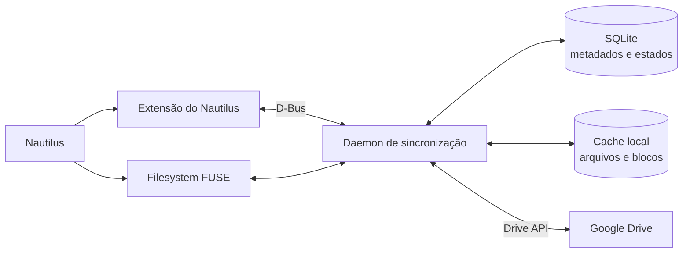

# Meu primeiro prompt
Agora uma dúvida mais filosófica. E se a gente criasse um aplicativo desktop para Linux que fizesse o que o Google Drive for Desktop faz? Ou seja, fazer a sincronização de arquivos, criar uma pasta no Nautilus, mostrar o ícone do check verde para cada arquivo que já está sincronizado e um check cinza ou outro símbolo para mostrar os que ainda estão apenas na nuvem, mas não estão no armazenamento local. Fazer também mostrar os arquivos fantasmas, assim como o Google Drive no macOS faz. Isso seria possível com as APIs que o Google oferece? Que tipo de tecnologia a gente precisa para implementar um aplicativo como este? Qual seria a melhor stack? Mas isso é só um exercício mental mesmo.

# Resposta do ChatGPT

Vou tratar isso como um estudo de viabilidade, não como proposta de começar o desenvolvimento. O resultado será:

- o que as APIs do Google permitem;
- como arquivos “fantasmas” poderiam funcionar no Linux;
- integração com Nautilus e ícones de estado;
- arquitetura do sincronizador;
- comparação de stacks;
- principais riscos técnicos e de produto;
- minha recomendação de stack para um protótipo.

Sim, seria possível construir algo bem próximo do Google Drive para desktop no Linux usando as APIs públicas do Google. O desafio maior não seria conversar com o Google Drive; seria criar uma integração confiável entre a nuvem, o filesystem Linux e o Nautilus.

A arquitetura mais natural seria um filesystem virtual com cache sob demanda, não uma pasta comum cheia de arquivos vazios.



## O que as APIs do Google permitem

A Drive API oferece praticamente todas as operações fundamentais:

- listar arquivos e pastas;
- consultar tamanho, MIME type, checksum e datas;
- baixar e enviar conteúdo;
- criar, mover, renomear e excluir;
- trabalhar com Shared Drives;
- obter um fluxo incremental de mudanças usando `changes.list`;
- exportar documentos nativos do Google, como Docs e Sheets.

A API mantém IDs estáveis para os arquivos, o que é essencial porque caminhos e nomes podem mudar. A aplicação manteria um banco local correlacionando cada `fileId` do Drive com o caminho exibido no Linux. [Referência de arquivos da Drive API](https://developers.google.com/workspace/drive/api/reference/rest/v3/files).

Para acompanhar alterações, um aplicativo desktop provavelmente usaria periodicamente `changes.list` e armazenaria o último page token processado. O Google oferece notificações push, mas elas exigem um webhook HTTPS público, portanto não são muito convenientes para um aplicativo puramente local sem um servidor intermediário. [Notificações de mudanças do Google Drive](https://developers.google.com/workspace/drive/api/guides/push).

## Como funcionariam os arquivos “fantasmas”

FUSE permite que um programa em espaço de usuário apresente um filesystem ao kernel Linux. Assim, poderíamos mostrar:

```text
~/Meu Drive/Clientes/contrato.pdf
```

mesmo que o conteúdo de `contrato.pdf` não esteja armazenado localmente.

O daemon saberia, pelo banco de metadados, que o arquivo:

```text
Tamanho lógico: 70 MB
Conteúdo local: 0 MB
Estado: somente na nuvem
```

Para o Nautilus, ele existiria normalmente, com nome, tamanho, datas e MIME type. Quando um programa tentasse abrir o arquivo, o FUSE enviaria uma solicitação ao daemon, que começaria a baixar os blocos necessários.

Os estados poderiam ser:

```text
☁ Somente na nuvem
↻ Baixando ou enviando
✓ Disponível localmente
✓ Sempre disponível offline
! Erro ou conflito
```

Isso é muito melhor que criar arquivos locais vazios de zero bytes. Um arquivo vazio poderia ser confundido com conteúdo real por outros programas. No FUSE, o arquivo tem o tamanho correto e sua leitura é interceptada pelo daemon. O próprio FUSE existe justamente para permitir que aplicações em espaço de usuário exportem filesystems ao kernel. [Documentação do libfuse](https://libfuse.github.io/doxygen/).

## Ícones no Nautilus

Uma extensão do Nautilus poderia consultar o daemon e adicionar um emblema a cada arquivo:

- check verde;
- nuvem cinza;
- setas de sincronização;
- aviso de erro.

O Nautilus fornece oficialmente `InfoProvider` e `FileInfo.add_emblem()` para extensões acrescentarem emblemas e atributos. Quando o estado muda, a extensão pode invalidar as informações para o Nautilus consultar novamente. [API de extensões do Nautilus](https://gnome.pages.gitlab.gnome.org/nautilus-python/class-nautilus-python-info-provider.html), [`add_emblem`](https://gnome.pages.gitlab.gnome.org/nautilus/method.FileInfo.add_emblem.html).

A extensão não deveria acessar o Google diretamente. Ela apenas perguntaria ao daemon local:

```text
Qual é o estado de /Meu Drive/Clientes/contrato.pdf?
```

O daemon responderia:

```json
{
  "state": "downloading",
  "progress": 42
}
```

Essa separação impediria que a interface do Nautilus ficasse bloqueada esperando a rede.

## Sincronização e cache

O daemon teria três responsabilidades diferentes:

1. Metadados

   Manter localmente a árvore de pastas, IDs, MIME types, tamanhos, versões e checksums.

2. Conteúdo

   Baixar blocos sob demanda e manter arquivos completos ou parciais no cache.

3. Reconciliação

   Detectar mudanças locais e remotas, fazer uploads e resolver conflitos.

O cache poderia usar arquivos esparsos. Um vídeo de 5 GB poderia aparecer com tamanho lógico de 5 GB, embora somente 100 MB estivessem presentes fisicamente. Um mapa de blocos registraria quais partes já foram hidratadas.

Também seria necessária uma política de descarte:

```text
Limite do cache: 20 GB
Arquivos fixados: nunca remover
Demais arquivos: remover pelo menos recentemente usado
Arquivo aberto: nunca remover durante o uso
```

“Remover” significaria desalojar apenas o conteúdo local, mantendo o arquivo fantasma no Nautilus.

## O problema difícil: consistência

A parte realmente trabalhosa estaria nos casos extremos:

- arquivo editado localmente e remotamente ao mesmo tempo;
- computador desligado durante um upload;
- renomeação enquanto o arquivo está aberto;
- perda temporária da internet;
- cache cheio;
- remoção remota de um arquivo aberto localmente;
- Shared Drives e permissões diferentes;
- nomes incompatíveis com regras do filesystem;
- atalhos do Drive;
- retomada de downloads e uploads interrompidos;
- múltiplos processos escrevendo no mesmo arquivo.

Uma política segura seria nunca sobrescrever silenciosamente um conflito. O aplicativo poderia criar:

```text
relatorio (conflito de Alan em 2026-09-02).docx
```

e manter ambas as versões.

Para documentos nativos do Google há outra dificuldade. Um Google Docs não possui um fluxo de bytes equivalente a um `.docx` comum. Ele precisaria ser representado por um atalho que abre o navegador ou exportado para algum formato. A Drive API possui `files.export`, mas a exportação tem regras próprias e limite documentado de 10 MB. [Downloads e exportações](https://developers.google.com/workspace/drive/api/guides/manage-downloads).

## Autenticação e distribuição

Para Linux desktop, o OAuth pode abrir o navegador e receber a resposta em um endereço local como:

```text
http://127.0.0.1:porta-aleatoria
```

Esse é o fluxo recomendado pelo Google para aplicativos instalados em Linux, macOS e Windows. O refresh token deveria ser guardado no GNOME Keyring/libsecret, nunca diretamente em texto puro. [OAuth para aplicativos desktop](https://developers.google.com/identity/protocols/oauth2/native-app).

Para sincronizar o Drive inteiro, porém, o aplicativo precisaria de um escopo amplo, como:

```text
https://www.googleapis.com/auth/drive
```

Esse é classificado como restrito. Um produto distribuído publicamente precisaria passar pela verificação OAuth do Google e possivelmente por requisitos adicionais de segurança. O escopo mais simples, `drive.file`, não permite implementar uma réplica transparente de todo o Drive: ele se limita aos arquivos criados pelo aplicativo ou explicitamente compartilhados com ele. [Escopos da Drive API](https://developers.google.com/workspace/drive/api/guides/api-specific-auth).

Para uso pessoal com seu próprio Client ID, isso é muito mais simples. Para virar um produto comercial, a verificação seria uma etapa relevante.

## Melhor stack

Para um produto robusto, minha escolha seria:

- Rust para o daemon e filesystem;
- FUSE 3 para os arquivos fantasmas;
- Tokio para operações concorrentes;
- SQLite em modo WAL para metadados, fila e mapa de blocos;
- `reqwest` para a Drive API;
- libsecret/GNOME Keyring para tokens;
- D-Bus para comunicação entre componentes;
- GTK 4 + libadwaita para configurações e status;
- extensão Nautilus em Python inicialmente;
- serviço `systemd --user` para inicialização e recuperação.

Rust é uma boa escolha porque essa aplicação lidaria simultaneamente com filesystem, concorrência, cache, rede e persistência. Erros de memória ou condições de corrida aqui poderiam corromper dados.

A extensão do Nautilus poderia começar em Python porque é pequena e a API oficial oferece bindings por GObject Introspection. Em produção, ela poderia continuar em Python ou ser substituída por uma extensão nativa se houvesse problemas de desempenho.

Flatpak não seria minha primeira escolha para distribuição, porque montar FUSE, manter um serviço do usuário e integrar profundamente com o Nautilus atravessa várias fronteiras do sandbox. Eu começaria com pacotes `.deb` e RPM, mais um serviço systemd do usuário.

## Caminho pragmático

Eu vejo três níveis possíveis:

1. Extensão sobre o rclone

   Reutilizar `rclone mount`, observar seu cache e adicionar ícones no Nautilus. É o protótipo mais rápido, mas o controle dos estados seria limitado.

2. Daemon próprio usando Drive API + FUSE

   Melhor equilíbrio para um produto real. Permite arquivos fantasmas, cache seletivo, pin offline, estados precisos e políticas de conflito.

3. Sincronização puramente local

   Baixar tudo para uma pasta convencional. É bem mais simples, mas não oferece verdadeiros arquivos sob demanda e deixa de se comportar como o Google Drive moderno.

Minha recomendação seria começar pelo nível 1 para validar a experiência: extensão do Nautilus, emblemas e painel de estado sobre o rclone. Se isso demonstrasse valor, o passo seguinte seria substituir gradualmente o mount por um daemon próprio em Rust.

Em resumo: as APIs do Google são suficientes. O componente especial não fornecido pelo Google seria o “motor de filesystem sob demanda”. No Linux, esse papel caberia ao FUSE, complementado por um daemon de sincronização, banco de metadados, cache esparso e uma extensão do Nautilus. O projeto é totalmente viável — mas está muito mais próximo de construir um pequeno Dropbox do que de simplesmente criar uma interface para o Google Drive.